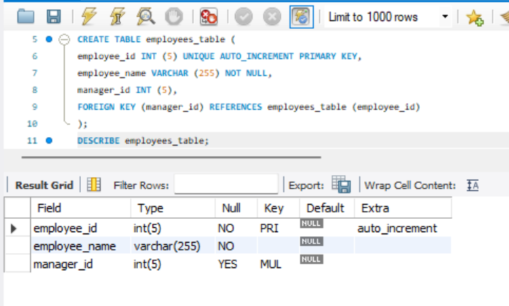
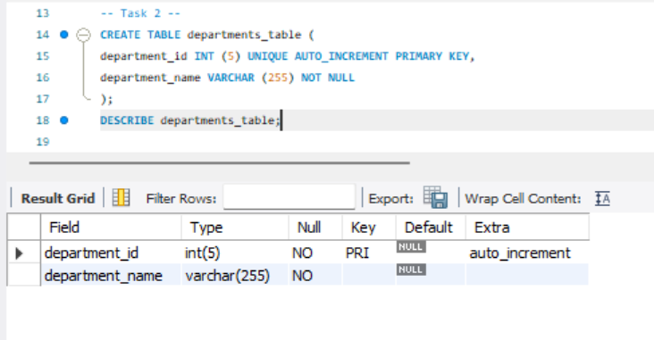
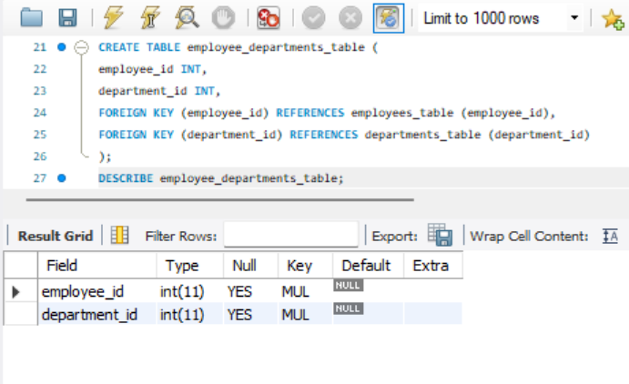
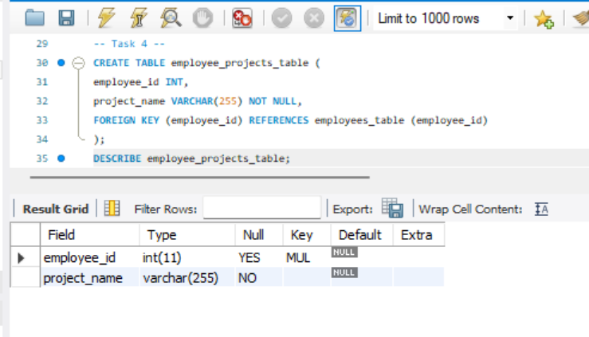
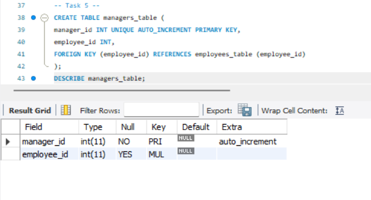
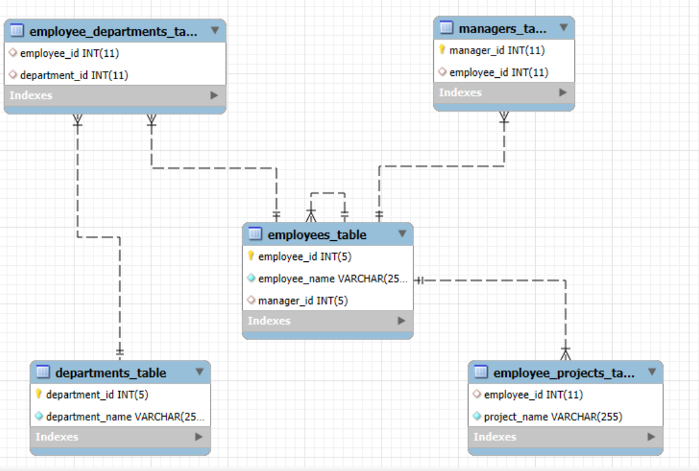
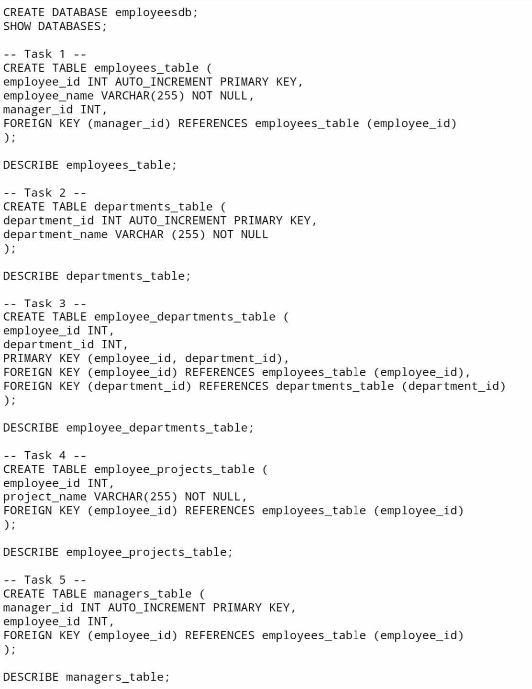

# Finals Task 1: Transform ER into Relational Tables
For this task, we need to implement the given MySQL statements. Please refer to the screenshot below for the query statements together with the tables.

Here's the screenshot for the ERR diagram.

Here's the SQL copy of the database and table structures

