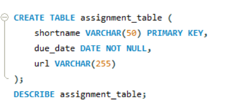

# Finals Task 2: Transform ER into Relational Tables
# Please refer to the screenshot below for the Query Statements.

- Query Statement 1 (Creating Student Table)
  

- Query Statement 2 (Creating Assignment Table)
  

- Query Statement 3 (Creating Submission Table)
  

# Please refer to the screenshot below for the Table Structures.

- Table Structure 1

- Table Structure 2

- Table Structure 3

# Please refer to the screenshot below for the ERR Diagram.
  

# Please refer to the screenshot below for the SQL Copy of the Database and Table Structure.
  

