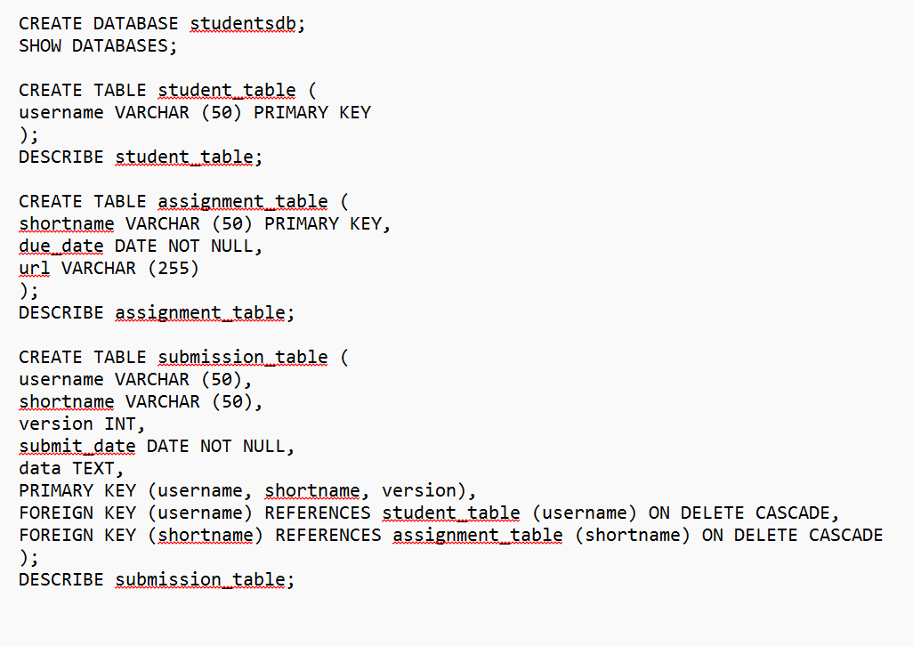

# Finals Task 2: Transform ER into Relational Tables
- Please refer to the screenshot below for the Query Statements.

- Please refer to the screenshot below for the Table Structures.

- Please refer to the screenshot below for the ERR Diagram.

- Please refer to the screenshot below for the SQL copy of the database and table structure.

