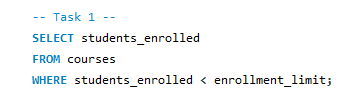
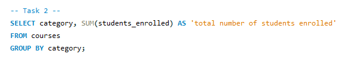
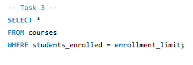
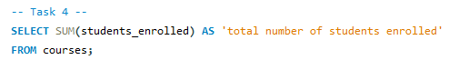
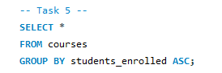

# Finals Task 3-1: Using Select Clause
# Please refer to the screenshot below for the Query Statements.

- Query Statement 1 (Retrieving all clauses where students enrolled is less than the enrollment limit)
  

- Query Statement 2 (Grouping courses by category and calculating the total number of students enrolled for each category)
  

- Query Statement 3 (Retrieving the courses that are fully enrolled)
  

- Query Statement 4 (Calculating the total number of students enrolled across all courses)
  

- Query Statement 5 (Sorting courses by students enrolled in ascending order)
  

# Please refer to the screenshot below for the Table Structures.

- Table Structure 1
.jpg)

- Table Structure 2
.jpg)

- Table Structure 3
.jpg)

- Table Structure 4
.jpg)

- Table Structure 5
.jpg)
