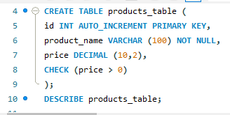
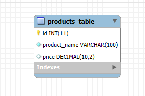
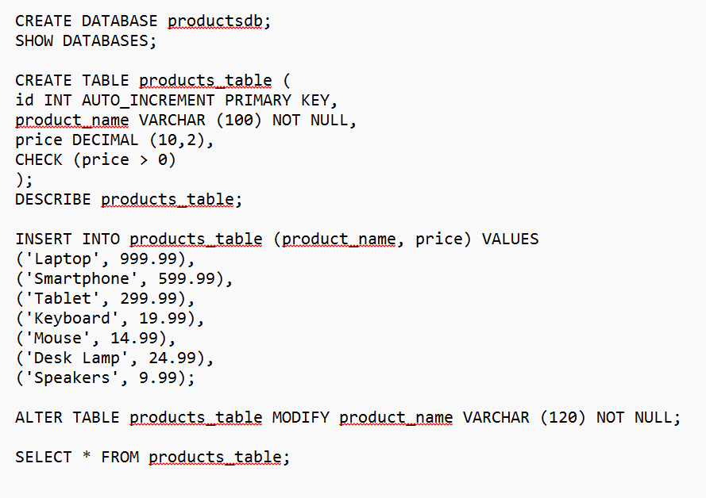

# Finals Task 3: Table Manipulation
# Please refer to the screenshot below for the Query Statements.

- Query Statement 1 (Creating Table)
  

- Query Statement 2 (Inserting Values)

- Query Statement 3 (Altering Table)

# Please refer to the screenshot below for the Table Structures.
- Table Structure 1

- Table Structure 2

# Please refer to the screenshot below for the ERR Diagram.

# Please refer to the screenshot below for the SQL Copy of the Database and Table Structure.

