# Finals Task 5: Views SP and Functions
# Please refer to the screenshot below for the Query Statements.

- Query Statement 1 (Creating Vendors View)
  
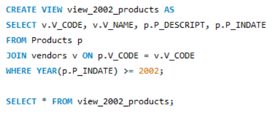

- Query Statement 2 (Creating Price View)
  
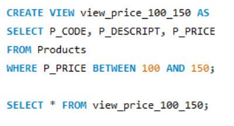

- Query Statement 3 (Creating Total Price View)
  
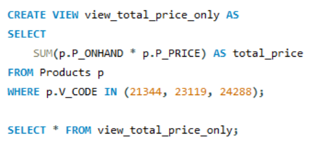

- Query Statement 4 (Updating Vendors)
  
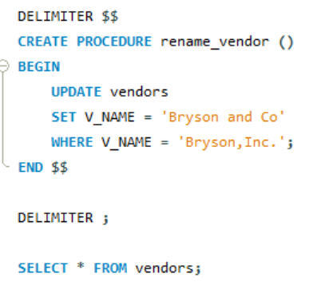

- Query Statement 5 (Getting Product Info)
  
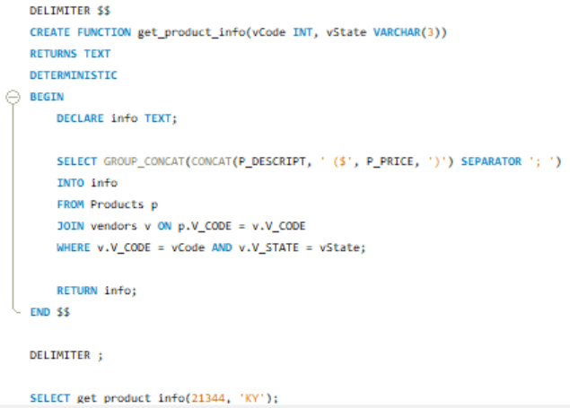

# Please refer to the screenshot below for the Table Structures.

- Table Structure 1
  
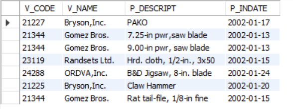

- Table Structure 2
  
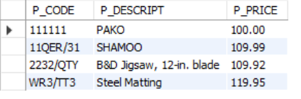

- Table Structure 3
  
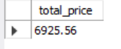

- Table Structure 4

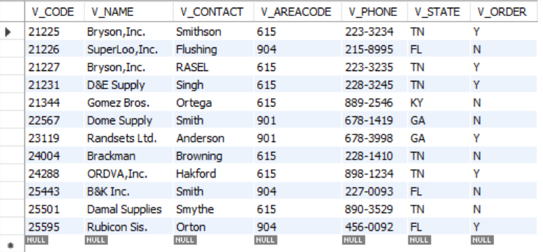

- Table Structure 5
  
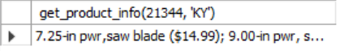

# Please refer to the screenshot below for the SQL Copy of the Database and Table Structure.
  
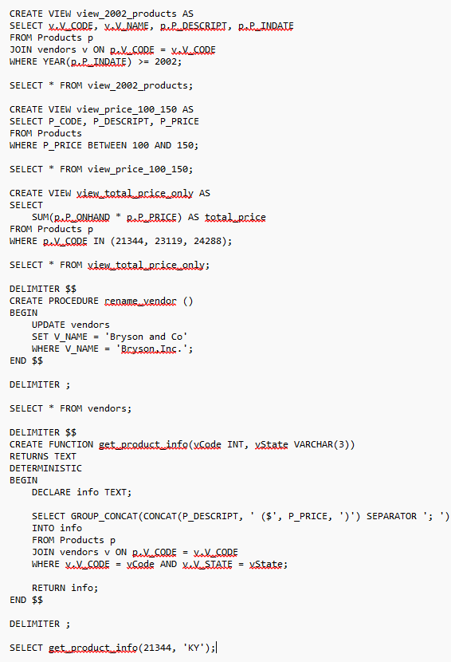

