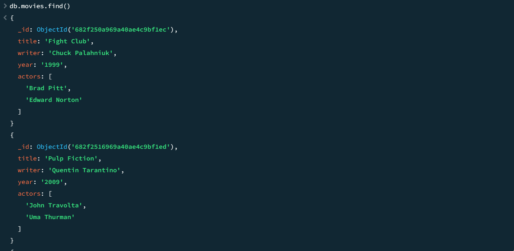
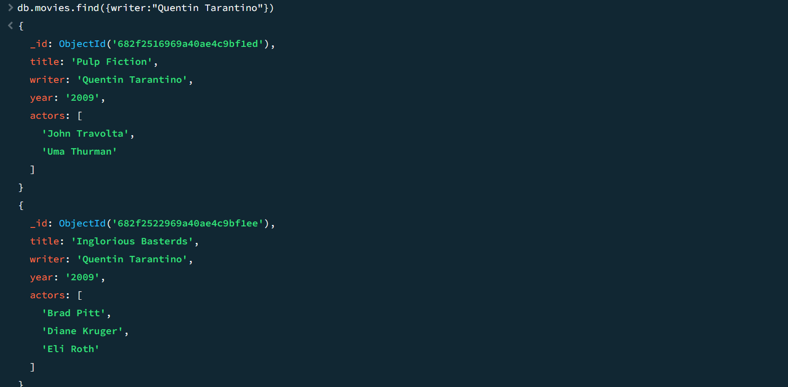
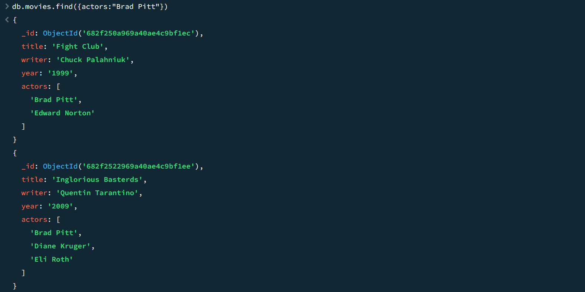
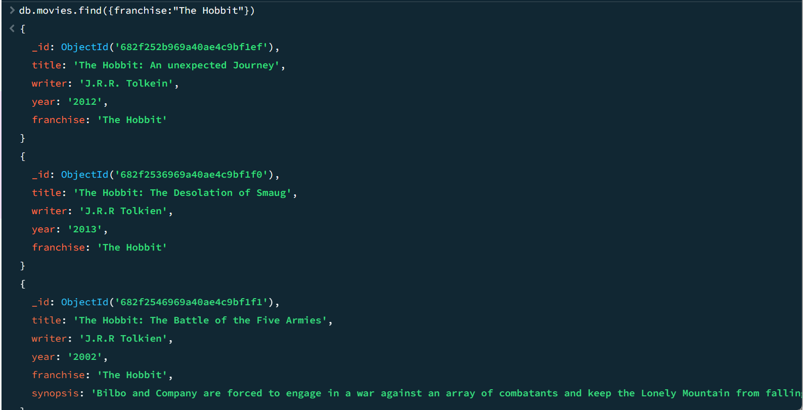
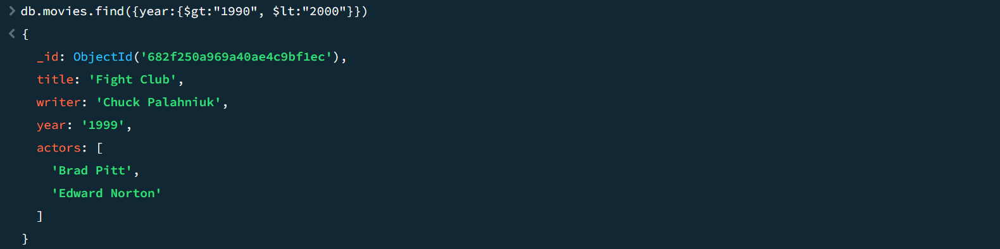
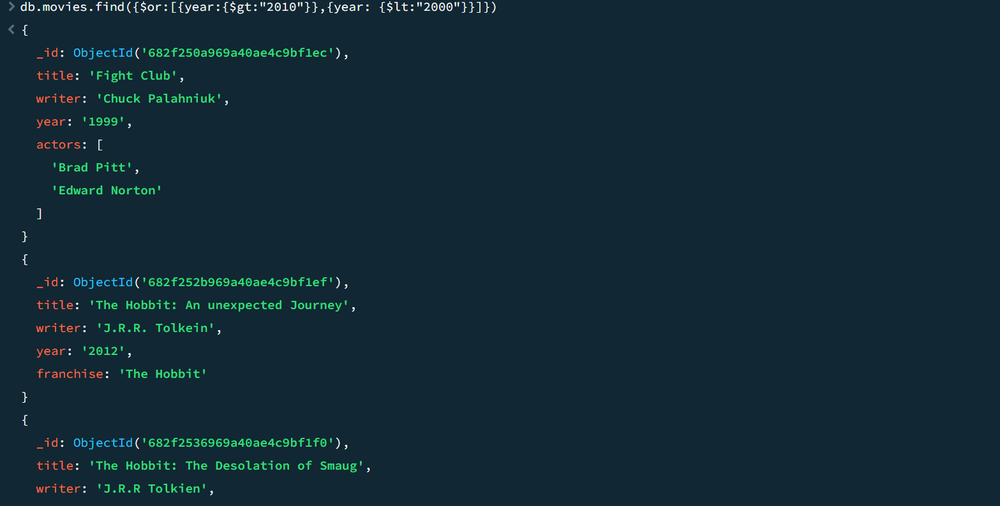

# Finals Task 6: MongoDB Practice
# Insert Documents (1-8)
  
.png)
  
.png)
  
.png)

# Query/Find Documents (1-8)
  

  
.png)
  
.png)

# Update Documents (1-3)

.png)

.png)

.png)

# Text Search (1-5)

.png)

.png)

.png)

.png)

.png)

# Delete Documents (1-2)

.png)

.png)

