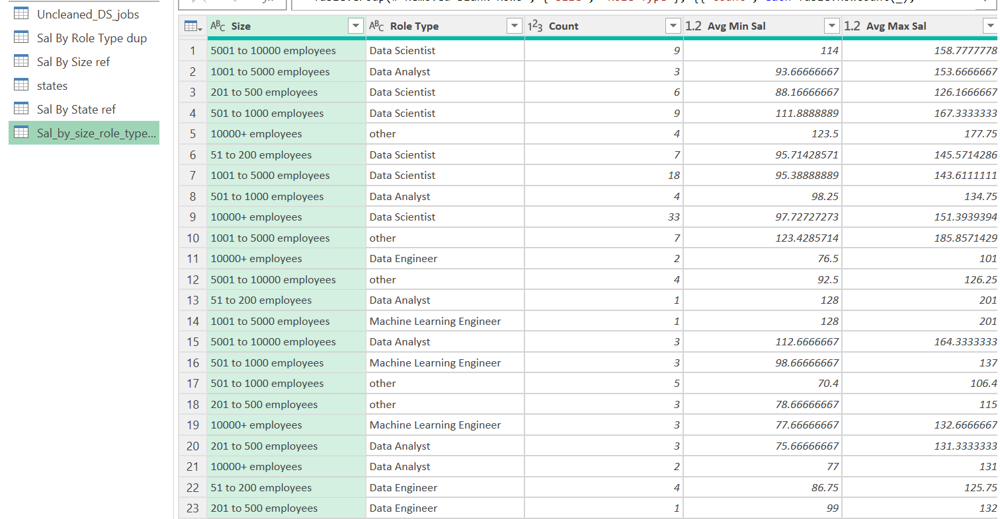
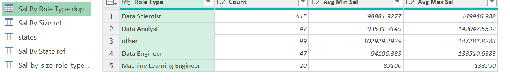
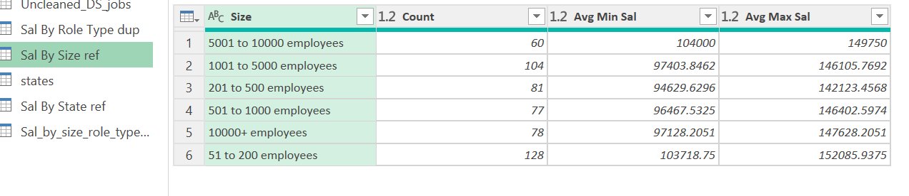

# Midterm Lab Task 2 Data Cleaning and Preparation using Power Query
For this task, we are given a flat data from Excel (See raw file), and we are task to perform Data Cleaning and Preparation using Power Query.

## Step 1 Data Cleaning Process
-Load the raw file
-Duplicate the raw data
-Salary Estimate Column
-Create 2 New Columns (From the Salary Estimate) Min Sal and Max Sal
-ADD COLUMN - Role Type
-SPLIT COLUMNS by Delimeter
-Select Location column
-Filter New Column
-Handle negative values

## Step 2 Here'sthe screenshot of my output before I started data cleaning using Power Query (See screenshot)
.jpg)
.jpg)

## Step 3 Here's the screenshot of my output after I started data cleaning using Power Query (See screenshot) 

## Step 4 Here's the screenshot of my group tables using Power Query (See screenshot)

.png)
.png)
.png)

## Here's the screenshot of my Query Dependencies (See screenshot)

