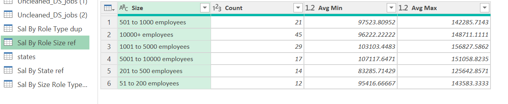

# Midterm Lab Task 2: Data Cleaning and Preparation using Power Query
For this task, we are given a flat data from Excel, and we are task to perform Data Cleaning and Preparation using Power Query.

## Step 1 Data Cleaning Process
- Load the raw file
- Duplicate the raw data
- Salary Estimate Column
- Create 2 New Columns (From the Salary Estimate) Min Sal and Max Sal
- ADD COLUMN - Role Type
- SPLIT COLUMNS by Delimeter
- Select Location column
- Filter New Column
- Handle negative values

## Step 2 Here's the screenshot of my output before I started data cleaning using Power Query (See screenshot)
.jpg)
.jpg)

## Step 3 Here's the screenshot of my output after I started data cleaning using Power Query (See screenshot) 
.png)
.png)
.png)
.png)
.png)

## Step 4 Here's the screenshot of my group tables using Power Query (See screenshot)

.png)
.png)
.png)

## Here's the screenshot of my Query Dependencies (See screenshot)

